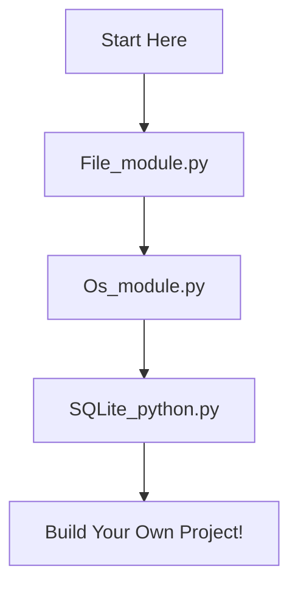

# ComputerVision_Scratch

Welcome to the Computer Vision from Scratch repository! This project contains Python modules and tutorials for learning computer vision concepts.

## 📁 Repository Structure

### Python Modules
1. **[File Operations Module](File_module.py)** - Learn file handling operations in Python
2. **[OS Module Tutorial](Os_module.py)** - Operating system interface functions
3. **[SQLite Database](SQLite_python.py)** - Database operations with SQLite

### Quick Navigation
| Module | Description | Difficulty |
|--------|-------------|------------|
| [File_module.py](File_module.py) | File I/O operations, reading/writing files | Beginner |
| [Os_module.py](Os_module.py) | System operations, path handling | Beginner |
| [SQLite_python.py](SQLite_python.py) | Database creation and queries | Intermediate |

## 🚀 Getting Started

### Prerequisites
- Python 3.x installed
- Basic understanding of Python syntax

### How to Use This Repository
1. Start with **File Operations** to understand basic I/O
2. Move to **OS Module** for system-level operations  
3. Finish with **SQLite** for database operations

## 📖 Module Details

### 1. File Operations Module
```python
# Example usage from File_module.py
# Basic file operations, text processing
```
**What you'll learn:**
- Reading and writing files
- File modes and handling
- Error handling with files

### 2. OS Module Tutorial  
```python
# Example usage from Os_module.py
# System path operations, directory handling
```
**What you'll learn:**
- Working with file paths
- Directory operations
- Environment variables

### 3. SQLite Database Operations
```python
# Example usage from SQLite_python.py  
# Database creation, CRUD operations
```
**What you'll learn:**
- Creating databases
- SQL queries in Python
- Data persistence

## 📚 Learning Path



## 🔗 Quick Links

### Essential Files (In Recommended Order)
- 🟢 [**START HERE: File Operations**](File_module.py) - Master file handling first
- 🟡 [**NEXT: OS Module**](Os_module.py) - Learn system operations  
- 🔴 [**ADVANCED: SQLite**](SQLite_python.py) - Database operations

### Additional Resources
- [Python Official Documentation](https://docs.python.org/3/)
- [SQLite Documentation](https://sqlite.org/docs.html)

## 🏃‍♂️ Quick Start Guide

1. **Clone the repository:**
   ```bash
   git clone https://github.com/Zero-iinfinity/ComputerVision_Scratch.git
   cd ComputerVision_Scratch
   ```

2. **Run the modules in order:**
   ```bash
   python File_module.py      # Start with file operations
   python Os_module.py        # Then system operations
   python SQLite_python.py    # Finally database operations
   ```

## 🤝 Contributing

Feel free to contribute by:
- Adding more examples
- Improving documentation
- Reporting bugs
- Suggesting new features


## 📞 Contact

- GitHub: [@Zero-iinfinity](https://github.com/Zero-iinfinity)
- Issues: [Report bugs or request features](https://github.com/Zero-iinfinity/ComputerVision_Scratch/issues)

---
⭐ **Star this repository if you found it helpful!** ⭐
